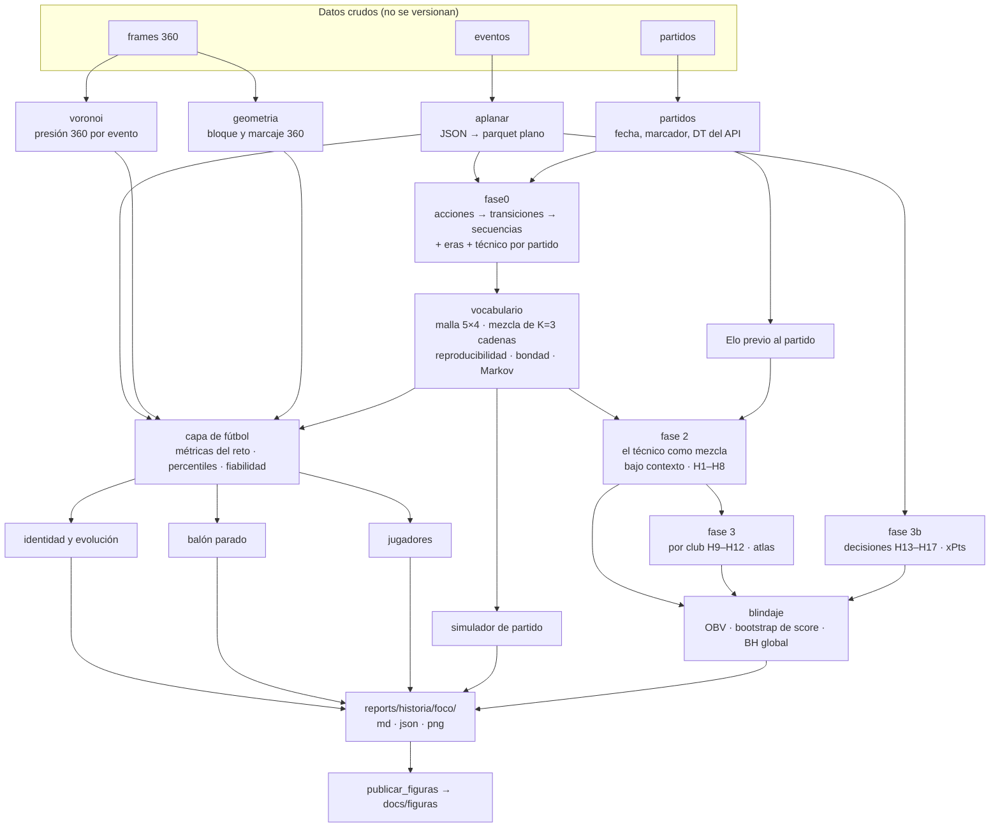

# 01 — Arquitectura: qué hace cada pieza y cómo fluye la información

> Para el *porqué* matemático de cada paso, ver `04_MODELO_MATEMATICO.md`. Para las
> definiciones exactas de cada objeto, `03_FRAMEWORK.md`. Para las decisiones y su
> historia, `06_DECISIONES.md`.

## 1. Qué datos usa y de dónde salen

| dato | qué es | cómo llega | dónde vive |
|---|---|---|---|
| **Eventos** | cada pase, conducción, remate, duelo, presión, cambio… de 1,767 partidos de Liga MX (5.7 M eventos), un `.json.gz` por partido | descarga del API de StatsBomb entregada para el hackathon; su integridad se verifica con `sha256sum -c data/MANIFIESTO_RAW.sha256` | `data/raw/statsbomb/events/` |
| **Partidos** | fecha, torneo, marcador, técnicos (`managers`), estado del 360 | misma descarga | `data/raw/statsbomb/matches/` |
| **Alineaciones** | onces y puestos | misma descarga | `data/raw/statsbomb/lineups/` |
| **360** | en cada evento, la posición de los jugadores que ve la cámara y el área visible (1,755 partidos, 5.1 M frames) | `scripts/descargar/descargar_360.py` con credenciales de StatsBomb (`SB_USERNAME`, `SB_PASSWORD`); reanudable, un archivo por partido | `data/raw/statsbomb/frames/` |
| **Eras** | qué técnico dirigió cada club en cada fecha, **verificadas a mano** (el `managers` del API solo verifica) | versionadas en el repo | `data/referencia/eras_api_v2/` |

**Los datos de StatsBomb son licenciados y nunca se versionan** (`data/raw`, `data/interim`,
`data/processed` y `reports/` están en `.gitignore`). Lo único que se publica son
figuras agregadas (`docs/figuras/`) y las eras.

## 2. El flujo completo



## 3. Cómo se corre, de cero a la historia

```bash
source .venv/bin/activate                 # Python 3.12, dtcoach instalado en modo editable
pytest -q                                 # 129 pruebas; si algo falla, no seguir

# 1. los datos de toda la liga (una vez)
dtcoach aplanar && dtcoach partidos && dtcoach fase0
bash scripts/vocabulario.sh               # malla y K por las reglas pre-registradas; mezcla, bondad, Markov
dtcoach elo

# 2. el técnico (fases 2 y 3)
bash scripts/correr_foco.sh "Guillermo Almada" 7

# 3. el 360 y la capa de fútbol
.venv-sb/bin/python scripts/descargar/descargar_360.py      # si aún no están los frames
dtcoach voronoi                           # presión por evento (≈ 5 min)
bash scripts/historia.sh "Guillermo Almada"                  # geometría, estilo, balón parado, jugadores,
                                                             # identidad, simulador, blindaje
# 4. publicar las figuras que muestran los documentos
bash scripts/publicar_figuras.sh "Guillermo Almada"
```

Todo lo que es de la liga se calcula **una vez** y se reutiliza (vocabulario, Elo, atlas,
tabla equipo-partido, rasgos 360). Cambiar de técnico solo corre lo del técnico.

## 4. El código

### Núcleo: de eventos a vocabulario

| archivo | qué hace | lo que se rompe si se toca mal |
|---|---|---|
| `config.py` | carga `config/default.yaml`; `hereda:` para configuraciones de experimento | todo: es el único lugar con parámetros |
| `aplanar.py` | JSON del API → parquet plano con esquema explícito | cualquier columna que falte aguas abajo |
| `ingest.py` | lectura y normalización del parquet | — |
| `partidos.py` | partidos, técnico del API por partido, verificación de eras | — |
| `eras.py` | asigna el técnico verificado a cada equipo-partido | **quién es el foco** |
| `grid.py` | malla y espacio de estados (zona × fase) | toda la cadena |
| `possessions.py` | acciones → transiciones → secuencias (ADR-v2-14) | **la validez de la cadena** |
| `estimate.py` | conteos, encogimiento, pliegues por partido | — |
| `absorbing.py` | N, t, B, V de una cadena absorbente | formas cerradas |
| `mezcla.py` | EM-MAP, escalera, reproducibilidad, resumen de tipos, bondad | el vocabulario |
| `mallado.py` | elección de malla por densidad predictiva | — |
| `markov.py` | verificación formal, espectro, irreversibilidad, llegada, memoria | — |

### El técnico: contexto, clubes, decisiones

| archivo | qué hace |
|---|---|
| `elo.py` | Elo previo al partido, K y ventaja local por log-pérdida |
| `contexto.py` | tabla por secuencia (responsabilidades, xG, contexto, f, g) y matriz de diseño |
| `pesos.py` | logit multinomial fraccional, sandwich por partido, Wald, bootstrap de score |
| `perfil.py` | perfiles crudos por familia con bootstrap por partido |
| `hipotesis.py` | H1–H8, BH, frases de cancha |
| `fase3.py` | por club (H9–H12) y atlas de todas las etapas |
| `decisiones.py` | tiempo y tipo de los cambios, reacomodos, rotación (H13–H17) |
| `simulador.py` | puntos esperados exactos (Poisson-binomial) y escenarios |

### Capa de fútbol (fases A–F)

| archivo | qué hace |
|---|---|
| `eventos.py` | lectura única de eventos (coordenadas, reloj) y tabla de posesiones |
| `comparar.py` | motor: foco contra liga, percentiles entre técnicos, fiabilidad entre mitades |
| `futbol.py` | métricas del reto (ofensiva, defensiva, transiciones, 360), llegada y valor con la cadena |
| `voronoi.py` | rasgos 360 por evento (celda de Voronoi local, rival más cercano) |
| `geometria.py` | bloque (envolvente convexa) y marcaje (algoritmo húngaro) |
| `balon_parado.py` | jugadas a balón parado, Poisson con exposición, zonas de remate |
| `jugadores.py` | cadena sobre jugadores, roles espectrales, protagonistas, impacto de cambios |
| `identidad.py` | huella, reconocimiento (logit L2, AUC, permutación), evolución (Kalman + RTS) |
| `simulacion.py` | simulador de partido con validación dejando el partido fuera |
| `blindaje.py` | eficiencia con OBV, BH global |
| `graficas.py`, `graficas_historia.py` | figuras (paleta validada) |
| `cli.py`, `cli_historia.py` | los comandos `dtcoach …` |

### Experimentos (probados, no adoptados; aislados en `config/presion*.yaml` y `config/direccion.yaml`)

| archivo | qué probó |
|---|---|
| `voronoi.py` (parte de la cadena) | estado zona × nivel de presión |
| `direccion.py` | estado zona × dirección de llegada |

## 5. Artefactos intermedios

| archivo | escribe | lee |
|---|---|---|
| `data/interim/events/part-*.parquet` | `aplanar` | casi todo |
| `data/interim/partidos.parquet` | `partidos` | fase0, Elo, simulador |
| `data/processed/transitions.parquet` | `fase0` | vocabulario, fase 2, capa de fútbol |
| `data/processed/mezcla/mezcla_K3.npz` | `mezcla` | fase 2, simulador |
| `data/processed/elo.parquet` | `elo` | fase 2, decisiones |
| `data/interim/rasgos_360.parquet` | `voronoi` | capa de fútbol |
| `data/interim/bloque_360.parquet`, `marcaje_360.parquet` | `geometria` | capa de fútbol |
| `data/processed/futbol/equipo_partido.parquet` | `futbol` (una vez) | todas las fases B–F |
| `reports/fase2/`, `reports/fase3/`, `reports/historia/<foco>/` | cada comando | humanos y el informe |

## 6. Cómo se sabe que funciona

* **129 pruebas** (`pytest -q`) contra verdades conocidas: cuentas exactas en partidos
  armados a mano, áreas contra fórmulas analíticas, y rasgos **sembrados** en ligas
  sintéticas (`tests/sinteticos.py`) que cada método debe encontrar sin inventar nada donde
  no se sembró.
* **Contrastes cruzados en los datos reales:** $E[T]$ del modelo contra el observado, KS de
  la duración, llegada modelada contra observada, estacionaria contra visitas, actor del
  frame 360 contra la ubicación del evento (mediana 0 m).
* **Reglas pre-registradas** (`11_HIPOTESIS.md`) escritas antes de ver cada resultado; las
  enmiendas llevan fecha y dicen si fueron antes o después de ver los datos.
