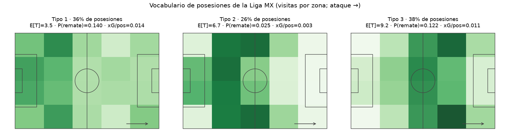
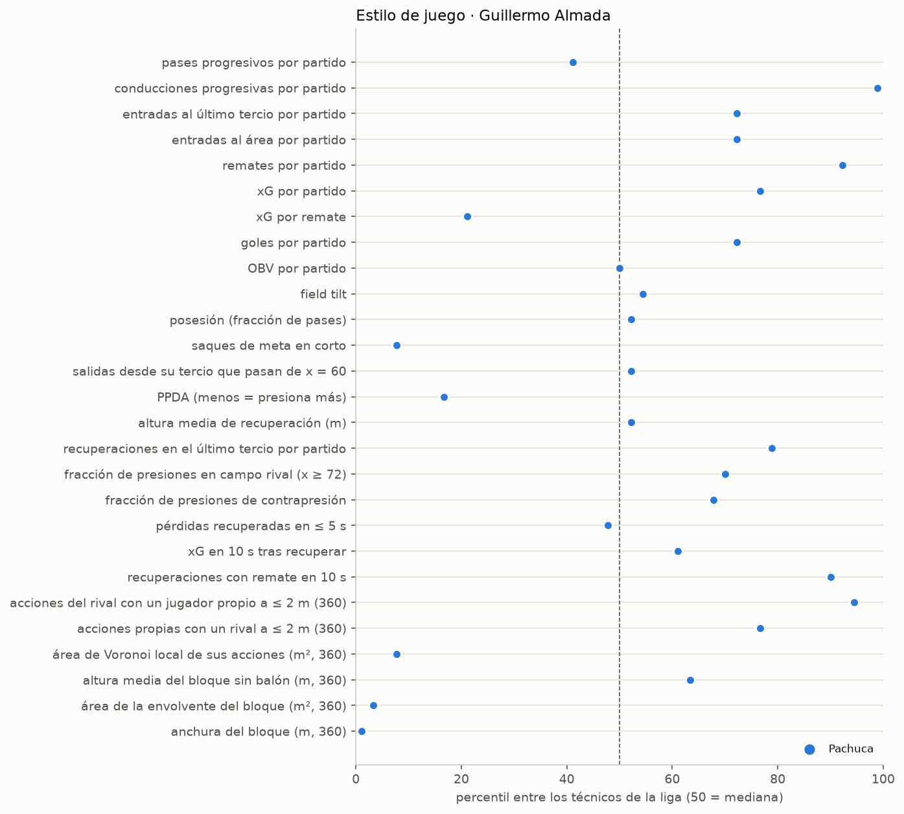
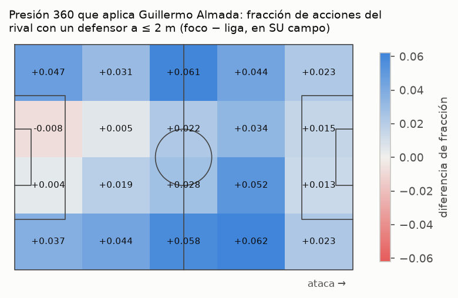
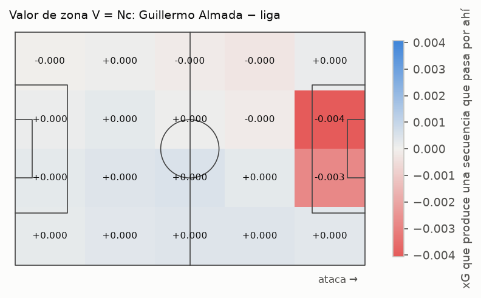
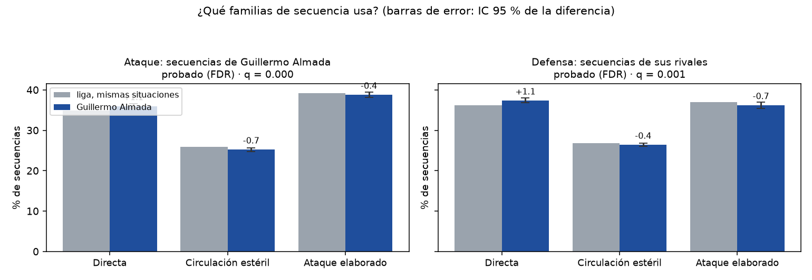
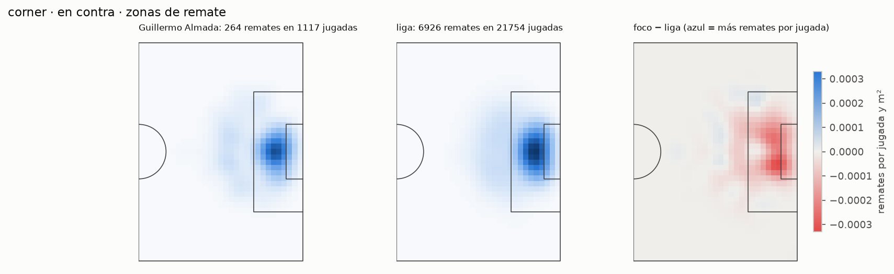
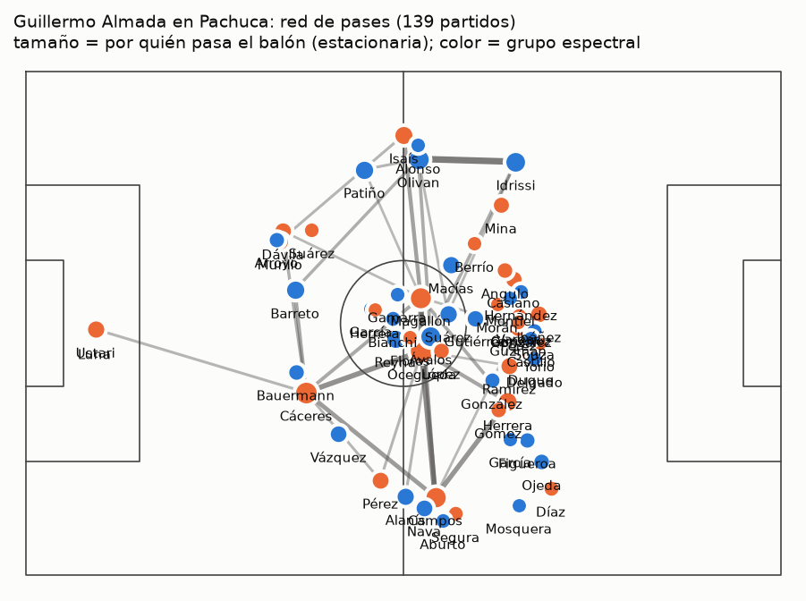
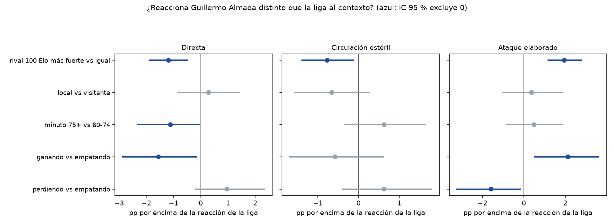
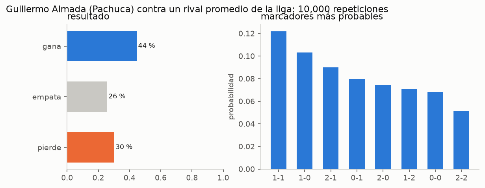

# Cómo juega Guillermo Almada — los resultados, explicados para todos

> **Para quién es esto.** Para alguien que nunca vio un partido de Almada y no sabe
> estadística. Cada idea viene con un dibujo y con la frase "¿cómo lo sabemos?".
> Los números exactos, sus intervalos y sus pruebas están en `10_RESULTADOS.md`; la
> matemática, en `04_MODELO_MATEMATICO.md`.
>
> Las figuras están en `docs/figuras/` (se generan con `bash scripts/publicar_figuras.sh`).

---

## La pregunta

Imagina que cada equipo de la Liga MX es una **cocina**. Todos usan los mismos
ingredientes (pases, conducciones, remates), pero cada cocinero hace su propia receta.
Queríamos saber:

1. **¿Almada tiene una receta propia**, o cocina lo mismo que todos?
2. **¿Qué ingredientes usa** para atacar y para defender?
3. **¿Cambia la receta** cuando va perdiendo, cuando el rival es fuerte o cuando se acaba el partido?
4. **¿La receta es suya o de su cocina?** Es decir: cuando cambió de club, ¿cocinó igual?

Antes de mirar los resultados escribimos **qué contaría como "sí"** (las hipótesis,
`11_HIPOTESIS.md`). Así no podíamos acomodar la respuesta después.

---

## Paso 1: aprender el idioma de la liga

Miramos **461,454 jugadas** de 1,767 partidos. Partimos la cancha en 20 casillas y
seguimos al balón de casilla en casilla hasta que la jugada termina (en remate, en
pérdida o fuera). Una computadora agrupó todas esas jugadas y encontró que casi todas se
parecen a **una de tres maneras de atacar**:

| manera | cómo se ve | cuánto dura | ¿termina en remate? |
|---|---|---|---|
| 🏃 **Directa** | recuperar y buscar el arco rápido | unas 3 o 4 acciones | 14 de cada 100 |
| 🔁 **Circulación estéril** | tocar en medio campo sin llegar | unas 7 acciones | 2 o 3 de cada 100 |
| 🧩 **Ataque elaborado** | construir y llegar por las bandas | unas 9 acciones | 12 de cada 100 |

*Cada mini-cancha es una manera de atacar: lo más oscuro es donde más pasa el balón.*

**¿Cómo sabemos que son tres y no cinco?** Le pedimos a la computadora que las buscara
muchas veces empezando desde lugares distintos. Con tres, siempre encontraba las mismas.
Con cuatro o más, cada vez encontraba otras distintas: esas no son reales.

También probamos dos ideas más sofisticadas: agregar hacia dónde venía el balón y
cuánta presión tenía el jugador (con las cámaras 360). Las dos ayudaban a **predecir** la
siguiente jugada, pero con ellas **ya no aparecían familias estables**. Conclusión honesta:
tres maneras de atacar es lo más fino que los datos permiten decir.

---

## Paso 2: la receta de Almada

### 1. Se le reconoce a kilómetros

Hicimos un juego: le mostramos a la computadora dos partidos, uno de Almada y otro de
cualquier otro equipo, **sin decirle cuál es cuál**, y le pedimos que adivinara.

* **Acierta 89 de cada 100 veces.** Si adivinara al azar, acertaría 50.
* Es el **2.º técnico más reconocible de 45** en la liga.
* Y lo más importante: acierta **86 de cada 100** cuando lo comparamos contra **Pachuca con
  otros técnicos**. O sea, lo que reconoce **no es Pachuca: es Almada**.

**¿Cómo lo sabemos?** El juego se hace con partidos que la computadora nunca vio al
aprender. Y para asegurarnos de que 89 no es suerte, repetimos el juego 200 veces con los
nombres revueltos: así acertaba alrededor de 50, y 95 de cada 100 veces menos de 55.

*Cada punto es un rasgo. A la derecha, "más que casi todos"; a la izquierda, "menos que casi
todos"; en medio, "como la mayoría".*

### 2. Aprieta encima del rival

* En **1 de cada 5** acciones del rival hay un jugador de Almada **a menos de 2 metros**. En
  la liga, 1 de cada 6. Eso lo pone **más arriba que el 94 %** de los técnicos.
* Deja **pocos pases** al rival antes de robarle (PPDA 8.5 contra 10.3 de la liga).
* Recupera más balones en el último tercio (13.7 por partido contra 12.0).

*Azul = zonas donde el equipo de Almada está encima del rival más seguido que la liga.*

**¿Cómo lo sabemos?** Con las cámaras 360 medimos, en cada acción del rival, a qué
distancia estaba el jugador más cercano. Son millones de fotos.

### 3. Defiende en un bloque estrecho

Cuando no tiene el balón, sus jugadores forman un bloque **más angosto y compacto que el de
todos** los técnicos de la liga (anchura: percentil 1; área: percentil 3). Cierra el centro.

**¿Cómo lo sabemos?** En cada foto 360 dibujamos la "liga" (envolvente) que rodea a los
defensores que ve la cámara y medimos su ancho y su área.

### 4. Sale largo, conduce hacia adelante y remata mucho

* **Saques de meta largos:** solo 32 de cada 100 en corto (la liga: 47).
* **Conduce hacia adelante** como casi nadie: 22.6 conducciones progresivas por partido
  (percentil 99).
* **Remata mucho:** 16 remates por partido contra 13 de la liga (percentil 92)… pero cada
  remate vale un poco menos (0.089 contra 0.097 de xG). Prefiere **cantidad** a esperar la
  ocasión perfecta.
* Después de recuperar, remata rápido más seguido que casi todos (percentil 90).
* Llega al último tercio **más veces y en menos toques** (2.5 contra 2.8 acciones).

### 5. Sus rivales la pasan mal

* Le rematan menos (11.9 contra 13.3 por partido) y le entran menos al área (9.5 contra 11.5).
* Sus rivales **llegan menos** al último tercio (54 % contra 59 %) y frente al área (12 %
  contra 16 %).
* Contra Almada, los rivales tienen que jugar **más Directa** (+1.1 puntos) y cuando lo hacen
  **generan menos peligro** (hipótesis H2 y H8, las dos confirmadas).

### 6. En el balón parado, marca al hombre

* Le rematan en **22 de cada 100 corners** en contra; en la liga, en 28. Es decir, **26 %
  menos** (y no es suerte: el intervalo va de 16 % a 35 % menos).
* Sus defensores están **más pegados a su atacante** (2.45 m contra 2.83 m) y deja **menos
  defensores sobrando** en el área (2.3 contra 2.9): marca **al hombre**, no a una zona.

**¿Cómo lo sabemos?** En la foto 360 del momento del saque, emparejamos a cada defensor con
un atacante de la manera más corta posible (el "algoritmo húngaro") y medimos la distancia.

### 7. Quién mueve el balón en Pachuca

*Cada círculo es un jugador: más grande = por él pasa más el balón. Los colores son los
grupos que se pasan el balón entre sí.*

* Por **Erick Sánchez** pasa el balón más que por nadie (7 % de los toques); le siguen
  **Gustavo Cabral** y **Luis Chávez**.
* Cuando el balón llega a **Salomón Rondón**, la jugada termina en remate más que con
  cualquier otro (18 %).

### 8. No se pone nervioso

Cuando **va perdiendo**, casi todos los equipos de la liga se vuelcan a elaborar (+5.2
puntos); el de Almada cambia menos (+3.6). Cuando **va ganando** o **enfrenta a un rival más
fuerte**, pasa lo mismo: **reacciona menos que la liga**. Su receta aguanta el partido.

*Hipótesis H3 (marcador) y H6 (rival): confirmadas, también con la prueba más estricta para
pocos partidos.*

Desde la banca, sus cambios suelen ser **del mismo puesto** (un delantero por un delantero) y
**casi no reacomoda** el sistema durante el partido (H15, H16).

### 9. La lleva a todos lados

La prueba de fuego: **¿cocina igual en otra cocina?** Seguimos su receta partido a partido,
en Santos Laguna, en Pachuca y en el América.

*Cada línea es un rasgo a lo largo del tiempo; la línea punteada es el cambio de club.*

* **Ningún rasgo suyo salta** al cambiar de club: presión, bloque, maneras de atacar… todo sigue
  igual. Lo único que cambió un poco al llegar a Pachuca fue cómo le atacan los rivales (menos Directa).
* En Santos (20 partidos) ya presionaba encima, sacaba largo y defendía estrecho.

Para comparar: con otro técnico de la liga (André Jardine), la receta **sí cambió de golpe**
al pasar de San Luis al América. Almada no: **impone su idea**.

### 10. ¿Y eso le da puntos?

Simulamos cada uno de sus partidos 10 mil veces con su estilo y el de su rival. Por estilo
esperábamos **257 puntos**; sacó **276**. Ojo: el simulador sirve para **explicar**, no para
adivinar resultados (acierta solo un poco más que tirar una moneda cargada con las
frecuencias de la liga).

---

## Las hipótesis, en una tabla

| pregunta | respuesta | ¿qué tan seguros? |
|---|---|---|
| ¿Ataca distinto que la liga? (H1) | Sí: más Directa, menos Circulación estéril | 🟢 confirmado |
| ¿Le cambia el partido al rival? (H2) | Sí: el rival juega más Directa | 🟢 confirmado |
| ¿Reacciona al marcador distinto? (H3) | Sí: reacciona **menos** que la liga | 🟢 confirmado |
| ¿Cambia en los últimos minutos? (H4) | No detectamos diferencia | ⚪ |
| ¿Juega distinto de local? (H5) | No detectamos diferencia | ⚪ |
| ¿Reacciona al rival fuerte distinto? (H6) | Sí: reacciona **menos** que la liga | 🟢 confirmado |
| ¿Sus ataques son más eficientes? (H7) | No: genera más por **volumen**, no por calidad | ⚪ |
| ¿Sus rivales son menos eficientes? (H8) | Sí, en Directa y en Ataque elaborado | 🟢 confirmado |
| ¿Su huella viaja a otro club? (H9) | Sí (Directa del rival), y todas las métricas de presión y bloque | 🟢 |
| ¿Se le reconoce? | Sí: 89 de 100, 2.º de 45 | 🟢 (p < 0.01) |
| ¿Es él y no el club? | Sí: 86 de 100 contra Pachuca sin él | 🟢 (p < 0.01) |

🟢 = los datos lo muestran con claridad, incluso corrigiendo por hacer muchas preguntas a la
vez · ⚪ = no encontramos diferencia (no quiere decir que no exista).

## Lo que NO sabemos (y lo decimos)

* **En el América solo lleva 7 partidos.** Todo lo del América es exploratorio: con tan pocos
  partidos, las pruebas se equivocan fácil (lo comprobamos: una prueba decía "segurísimo" y la
  prueba correcta para pocos partidos decía "ni idea").
* **Nada de esto es causa y efecto.** Describimos lo que hizo su equipo; no podemos separar del
  todo al técnico de sus jugadores.
* **Las cámaras 360 no ven a todos.** Medimos solo con los jugadores que aparecen en cada foto.
* **El xG y el OBV son modelos del proveedor.** Por eso revisamos la eficiencia con los dos y
  con algo que no depende de ningún modelo (cuántas jugadas terminan en remate). Coinciden.

## En una frase

> **Guillermo Almada impone la misma idea en cada club: aprieta encima, defiende angosto,
> sale largo y remata mucho; es el segundo técnico más reconocible de la Liga MX y su receta
> no cambia ni con el marcador ni con el club.**
