# Cómo juega Guillermo Almada — los resultados, explicados para todos

> **Para quién es esto.** Para alguien que nunca vio un partido de Almada y no sabe
> estadística. Cada idea viene con un dibujo y con la frase "¿cómo lo sabemos?".
> Los números exactos, sus intervalos y sus pruebas están en `10_RESULTADOS.md` y en
> `reports/historia/guillermo_almada/<sección>/`; la matemática, en `04_MODELO_MATEMATICO.md`.
>
> Las figuras están en `docs/figuras/<sección>/` (se generan con `bash scripts/publicar_figuras.sh`).
> Todas las cifras salen de la corrida completa de la fase G (61 hipótesis corregidas juntas en el
> blindaje global).

**Índice:** [0. El idioma de la liga](#0-el-idioma-de-la-liga) ·
[1. Identidad](#1-identidad-tiene-una-receta-propia) · [2. Ataque](#2-cómo-ataca) ·
[3. Defensa](#3-cómo-defiende) · [4. Jugadores y banca](#4-sus-jugadores-y-su-banca) ·
[5. Balón parado](#5-balón-parado) · [6. Simulación](#6-simulación-y-cómo-le-iría-en-el-américa) ·
[Hipótesis](#las-hipótesis-en-una-tabla) · [Lo que no sabemos](#lo-que-no-sabemos-y-lo-decimos)

---

## La pregunta

Imagina que cada equipo de la Liga MX es una **cocina**. Todos usan los mismos
ingredientes (pases, conducciones, remates), pero cada cocinero hace su propia receta.
Queríamos saber:

1. **¿Almada tiene una receta propia**, o cocina lo mismo que todos?
2. **¿Qué ingredientes usa** para atacar y para defender?
3. **¿Cambia la receta** cuando va perdiendo, cuando el rival es fuerte o cuando se acaba el partido?
4. **¿La receta es suya o de su cocina?** Es decir: cuando cambió de club, ¿cocinó igual?

Antes de mirar los resultados escribimos **qué contaría como "sí"** (las hipótesis,
`11_HIPOTESIS.md`). Así no podíamos acomodar la respuesta después.

---

## 0. El idioma de la liga

Miramos **461,454 jugadas** de 1,767 partidos. Partimos la cancha en 20 casillas y
seguimos al balón de casilla en casilla hasta que la jugada termina (en remate, en
pérdida o fuera). Una computadora agrupó todas esas jugadas y encontró que casi todas se
parecen a **una de tres maneras de atacar**:

| manera | cómo se ve | cuánto dura | ¿termina en remate? |
|---|---|---|---|
| 🏃 **Directa** | recuperar y buscar el arco rápido | unas 3 o 4 acciones | 14 de cada 100 |
| 🔁 **Circulación estéril** | tocar en medio campo sin llegar | unas 7 acciones | 2 o 3 de cada 100 |
| 🧩 **Ataque elaborado** | construir y llegar por las bandas | unas 9 acciones | 12 de cada 100 |

*Cada mini-cancha es una manera de atacar: lo más oscuro es donde más pasa el balón.*

**¿Cómo sabemos que son tres y no cinco?** Le pedimos a la computadora que las buscara
muchas veces empezando desde lugares distintos. Con tres, siempre encontraba las mismas.
Con cuatro o más, cada vez encontraba otras distintas: esas no son reales.

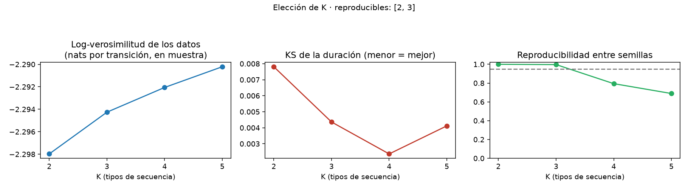

---

## 1. Identidad: ¿tiene una receta propia?

### Se le reconoce a kilómetros

Hicimos un juego: le mostramos a la computadora dos partidos, uno de Almada y otro de
cualquier otro equipo, **sin decirle cuál es cuál**, y le pedimos que adivinara.

* **Acierta 89 de cada 100 veces.** Si adivinara al azar, acertaría 50.
* Es el **2.º técnico más reconocible de 45** en la liga.
* Acierta **86 de cada 100** cuando lo comparamos contra **Pachuca con otros técnicos**. O
  sea, lo que reconoce **no es Pachuca: es Almada**.

**¿Cómo lo sabemos?** El juego se hace con partidos que la computadora nunca vio al
aprender, y para asegurarnos de que 89 no es suerte repetimos el juego con los nombres
revueltos: así acertaba alrededor de 50, y 95 de cada 100 veces menos de 55.

### No se pone nervioso (marcador y rival)

Cuando **va perdiendo**, casi todos los equipos de la liga se vuelcan a elaborar (+5.2
puntos); el de Almada cambia menos (+3.6). Cuando **va ganando** o **enfrenta a un rival más
fuerte**, pasa lo mismo: **reacciona menos que la liga**. Su receta aguanta el partido
(H3 y H6, confirmadas también con la prueba más estricta para pocos partidos).

### ¿Juega distinto contra fuertes y contra débiles?

Partimos a sus rivales en tres grupos según su nivel antes del partido (su Elo): los
**débiles** (el 25 % más bajo de la liga), los **medios** y los **fuertes** (el 25 % más alto).
En cada grupo comparamos a Almada **con la liga contra ese mismo tipo de rival**, para no
confundir "Almada" con "jugar contra el América".

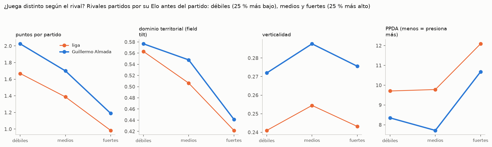

*Cada panel es una medida; la línea azul es Almada y la naranja la liga, contra cada tipo de rival.*

**Qué dice:** los rivales débiles tienen un Elo de 1456 o menos, y los fuertes de 1557 o más.

| rival | puntos por partido de Almada | la liga contra ese rival | diferencia [IC 95 %] |
|---|---|---|---|
| fuerte | 1.19 | 0.98 | +0.21 [−0.21, +0.63] |
| medio | 1.70 | 1.39 | **+0.31 [+0.05, +0.58]** |
| débil | 2.03 | 1.67 | +0.36 |

* Saca más puntos que la liga **contra todos**. Donde más claro se ve es contra los rivales medios.
  Contra los fuertes también suma más, pero con tan pocos partidos no se puede separar de la suerte.
* **Su manera de jugar se ajusta al rival igual que la de la liga** (H22 ⚪). Ninguna medida cambia de
  fuertes a débiles de forma distinta que en el resto de los equipos. En resumen: no tiene un plan
  especial para los grandes, **juega igual contra todos**. Esto coincide con lo que vimos arriba: reacciona
  menos que la liga al marcador y al rival.

### La lleva a todos lados

La prueba de fuego: **¿cocina igual en otra cocina?** Seguimos su receta partido a partido,
en Santos Laguna, en Pachuca y en el América.

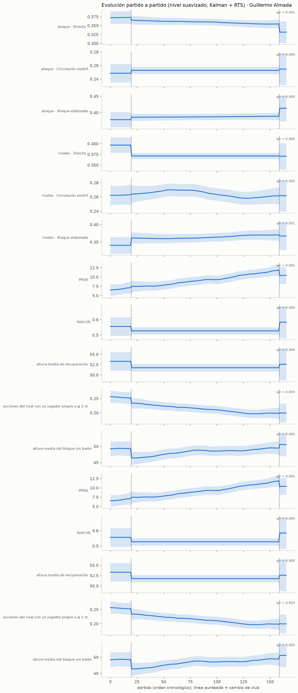

*Cada línea es un rasgo a lo largo del tiempo; la línea punteada es el cambio de club.*

* **Ningún rasgo suyo salta** al cambiar de club: presión, bloque, maneras de atacar… todo
  sigue igual. Lo único que cambió un poco al llegar a Pachuca fue cómo le atacan los rivales.
* Para comparar: con otro técnico de la liga (André Jardine), la receta **sí cambió de golpe**
  al pasar de San Luis al América. Almada no: **impone su idea**.

---

## 2. Cómo ataca

La historia del ataque en cuatro momentos: **sale**, **avanza**, **llega** y **remata**.

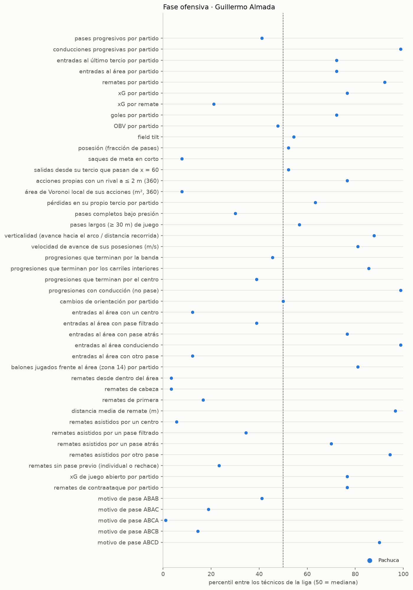

*Cada punto es un rasgo. A la derecha, "más que casi todos"; a la izquierda, "menos que casi
todos"; en medio, "como la mayoría".*

### Sale largo

* **Saques de meta largos:** solo 32 de cada 100 en corto (la liga: 47).
* En el juego (sin contar los saques), **da tantos pases largos como la liga** (20 de cada 100).
  Solo es largo desde el arco.
* Con un rival encima completa **un poco menos** de pases (69 de cada 100 contra 72). Es el precio
  de jugar rápido.

### Avanza rápido y hacia adelante

* **Conduce hacia adelante** como casi nadie: 22.6 conducciones progresivas por partido
  (percentil 99).
* Llega al último tercio **más veces y en menos toques** (2.5 contra 2.8 acciones).
* **Verticalidad** (H18 🟢): de cada metro que recorre su balón, **28 cm van hacia el arco rival**;
  en la liga, 25 (percentil 88). Además, **el balón avanza más rápido**: 2.78 m por segundo contra 2.48
  (percentil 81).
* **Avanza conduciendo:** 39 de cada 100 progresiones son con el balón en los pies. En la liga son 32
  (percentil 99).
* **Por dónde avanza** (H19 🟡): un poco más por los **carriles interiores** (41 % contra 40 %). La
  diferencia es chica: pasa la prueba de su sección, pero en la corrección global de las 61 hipótesis
  baja a "pista" (q = 0.07).
* Pisa la **zona 14** (justo afuera del área, al centro) 21 veces por partido. La liga, 17
  (percentil 81).

### Llega al área y remata mucho

* **Remata mucho:** 16 remates por partido contra 13 de la liga (percentil 92)… pero cada
  remate vale un poco menos (0.089 contra 0.097 de xG). Prefiere **cantidad** a esperar la
  ocasión perfecta.
* Después de recuperar, remata rápido más seguido que casi todos (percentil 90).
* **Cómo entra al área** (H20 🟢): **conduciendo** en 47 de cada 100 entradas (la liga: 37,
  percentil 99) y **con centro** solo en 15 (la liga: 20, percentil 12). **Entra con el balón en los
  pies, no colgándolo.**
* **Qué asiste sus remates:** un centro en 12 de cada 100 (la liga: 15, percentil 6); un pase por
  el suelo en 59 (la liga: 54).
* **Y eso se nota en sus remates:** remata **más lejos** (21.2 m contra 19.8, percentil 97), menos
  **dentro del área** (51 % contra 58 %, percentil 3) y menos **de cabeza** (15 % contra 20 %,
  percentil 3). Es la explicación de por qué cada remate suyo vale un poco menos: muchos son de afuera.

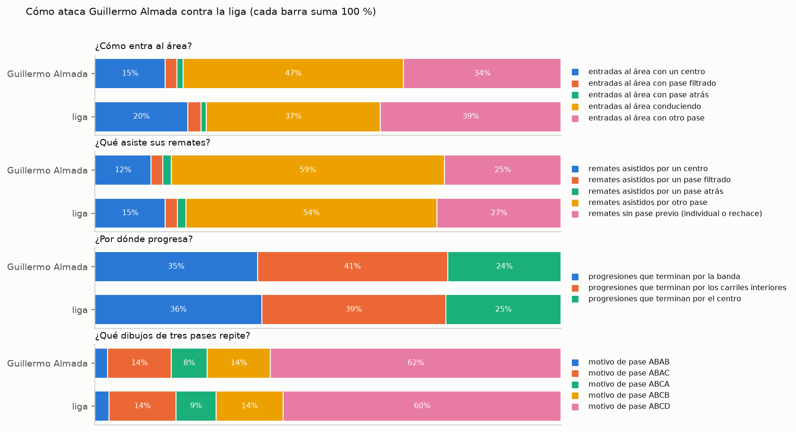

*Cada barra suma 100 %: arriba Almada, abajo la liga. Si los colores se reparten distinto,
ataca distinto.*

* **Los dibujos de tres pases que repite** (H21 🟢): ida y vuelta (ABAB), pared y salida (ABAC),
  triangulación (ABCA)… Es su "letra" al tocar la pelota. Almada usa más el **ABCD** (el balón pasa por
  cuatro jugadores distintos, siempre hacia adelante): 62 % contra 60 % (percentil 90). Usa menos la
  **triangulación que vuelve** (ABCA): 7.7 % contra 8.6 % (percentil 1). **El balón no regresa: avanza.**

### Las tres maneras de atacar, dibujadas

Antes solo contábamos cuánto usa cada manera. Ahora la dibujamos: para cada una, **por dónde
pasa el balón de Almada más que el de la liga** (azul) y **el camino más probable** desde
donde empieza hasta el remate (flechas).

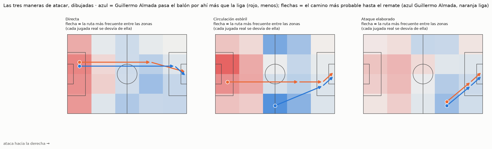

**Qué camino toma cada una:**

* **Directa:** sale desde atrás y va al área **por el centro**. La liga hace el mismo viaje, pero
  cae más hacia una banda.
* **Circulación estéril:** la de Almada **empieza en la banda, a la altura del medio campo**, y de ahí
  va al área. La de la liga empieza en su propia área y da un rodeo más largo. Cuando su equipo
  "circula", ya lo hace arriba.
* **Ataque elaborado:** el mismo camino que la liga, desde el carril derecho del último tercio.

*Ojo: la flecha es la ruta **más frecuente** entre zonas, no una jugada real. Casi ninguna jugada la
sigue exacta; es el "promedio" del recorrido.*

---

## 3. Cómo defiende

### Aprieta encima del rival

Imagina que cada vez que el rival toca el balón le tomamos una foto y medimos a qué distancia
está el jugador de Almada más cercano.

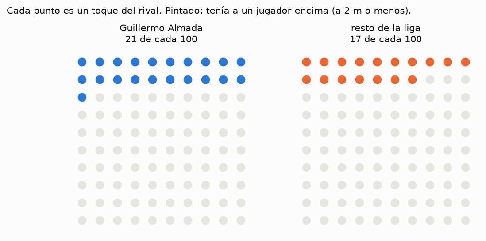

* En **21 de cada 100** toques del rival hay un jugador de Almada **a menos de 2 metros**. En
  la liga, 17. Eso lo pone **más arriba que el 94 %** de los técnicos.
* Deja **pocos pases** al rival antes de robarle (PPDA 8.5 contra 10.3 de la liga).
* Recupera más balones en el último tercio (13.7 por partido contra 12.0).

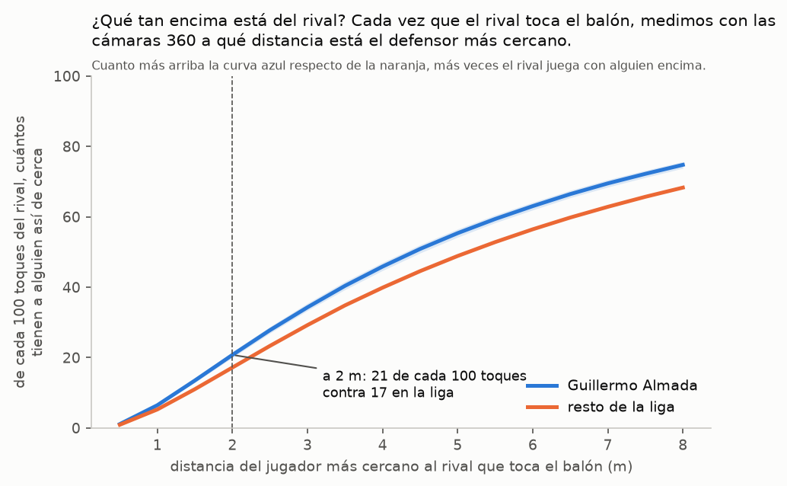

*Cómo leerla: en el eje de abajo, la distancia; hacia arriba, cuántos toques del rival tienen
a alguien así de cerca. Si la curva azul va por encima, Almada está más encima que la liga a
cualquier distancia.*

**Dónde aprieta:** en las tres zonas, pero **sobre todo arriba**.

| dónde recibe el rival | con un jugador de Almada a < 2 m | la liga | percentil |
|---|---|---|---|
| saliendo desde atrás (su tercio) | **15 de cada 100** | 12 | 99 |
| en el medio | **21** | 16 | 97 |
| cerca del arco de Almada | 27 | 24 | 81 |

La diferencia más grande con la liga está **donde el rival empieza la jugada**: ahí presiona como casi
nadie.

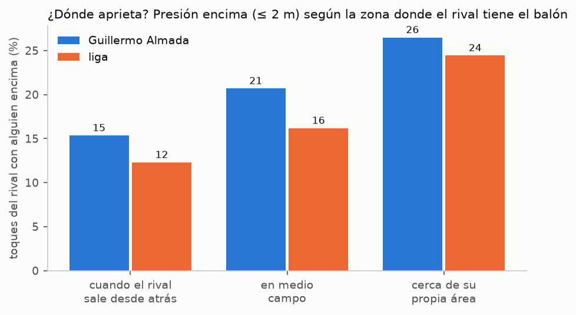

### Defiende en un bloque estrecho

Primero, qué medimos: en cada foto de las cámaras 360, rodeamos con una "liga elástica" a los
defensores que se ven y medimos qué tan **ancho**, qué tan **profundo** y qué tan **lejos de su
arco** queda ese bloque.

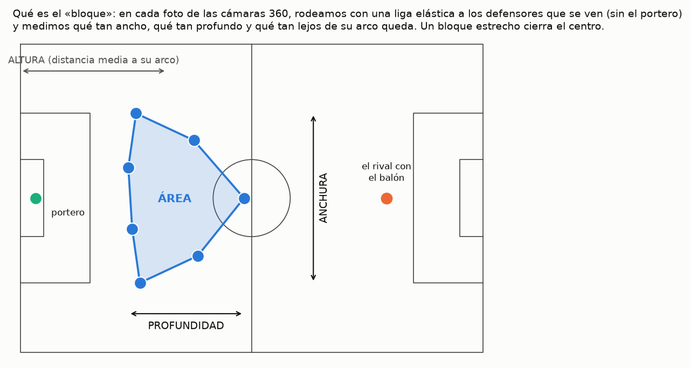

Cuando no tiene el balón, el bloque de Almada es **más angosto y compacto que el de todos** los
técnicos de la liga (anchura: percentil 1; área: percentil 3). Cierra el centro.

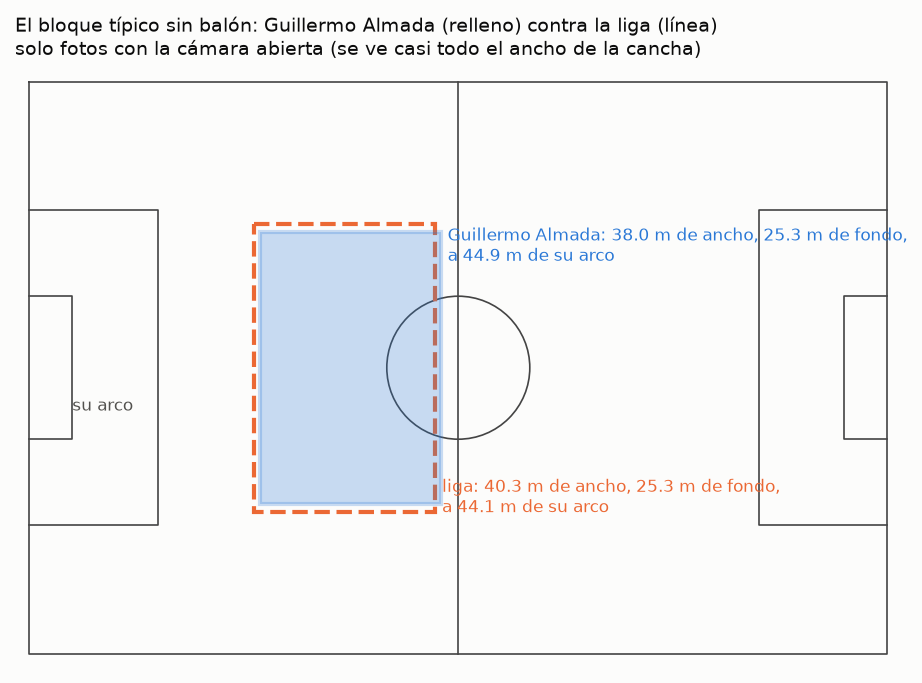

**¿Y si es la cámara?** Si en sus partidos la cámara encuadrara más cerrado, el bloque se vería
más estrecho sin serlo. Por eso repetimos la medida **solo con fotos donde se ve casi todo el ancho
de la cancha** (70 m o más).

* **La diferencia sigue:** 38.2 m de ancho contra 40.1 m de la liga, **percentil 1**. El bloque
  estrecho es de verdad.
* En sus partidos la cámara sí abre un poco menos (69.7 m visibles contra 70.3), pero son 60 cm: no
  explican los 2 m del bloque.

### Sus rivales la pasan mal

* Le rematan menos (11.9 contra 13.3 por partido) y le entran menos al área (9.5 contra 11.5).
* **El precio:** cuando el rival logra salir de la presión, **avanza más rápido** que contra el resto
  (2.76 m/s contra 2.48). Presionar arriba deja espacio atrás.
* Sus rivales **llegan menos** al último tercio (54 % contra 59 %) y frente al área (12 %
  contra 16 %).
* Contra Almada, los rivales tienen que jugar **más Directa** y, cuando lo hacen, **generan
  menos peligro** (H2 y H8, confirmadas).

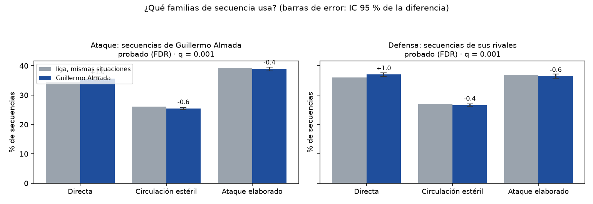

---

## 4. Sus jugadores y su banca

### Quién mueve el balón en Pachuca

*Cada círculo es un jugador: más grande = por él pasa más el balón. Los colores son los
grupos que se pasan el balón entre sí.*

* Por **Erick Sánchez** pasa el balón más que por nadie (7 % de los toques); le siguen
  **Gustavo Cabral** y **Luis Chávez**.
* Cuando el balón llega a **Salomón Rondón**, la jugada termina en remate más que con
  cualquier otro (18 %).

### Desde la banca no desarma su equipo

* Cuando va perdiendo, **82 de cada 100** de sus cambios son del **mismo puesto** (un delantero
  por un delantero); en la liga, 72. Mete **la mitad de cambios ofensivos** que la liga
  (11 contra 20 de cada 100). No cambia de idea: cambia de piernas (H15 🟢).
* Reacomoda la formación **1.4 veces por partido**; la liga, 1.8 (H16 🟢).
* Hace su primer cambio del segundo tiempo **unos 2 minutos antes** que la liga cuando va
  perdiendo o empatando, pero la prueba conjunta no alcanza (H13 ⚪): es una pista.

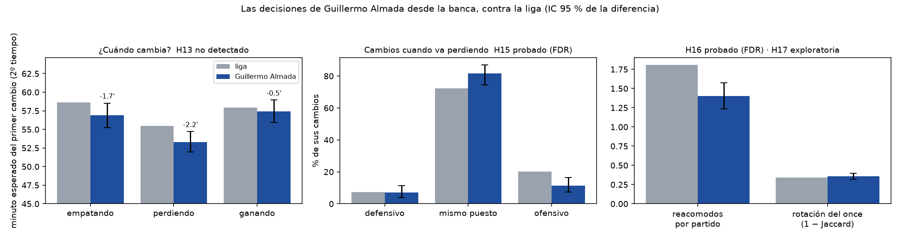

### ¿Qué cambia cuando hace un cambio?

Comparamos los 10 minutos antes y después de **cada** cambio suyo con lo que pasa en los
cambios de la liga **en el mismo minuto y con el mismo marcador** (así no confundimos "el
cambio" con "el cansancio del final"). Medimos su xG, el del rival, quién domina el terreno y
si su equipo cambia de manera de atacar (H23).

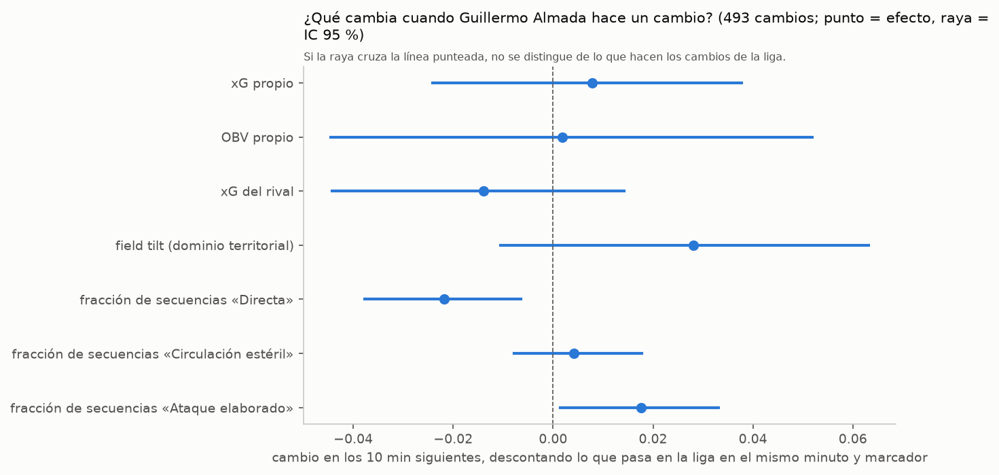

*Punto = efecto; raya = margen de error. Si la raya cruza la línea punteada, no se distingue de la liga.*

**Qué dice** (489 cambios suyos contra 8,638 de la liga):

* **Sus cambios no cambian el marcador de ocasiones** (H23 ⚪): el xG a favor y en contra después
  del cambio se mueve igual que en la liga.
* **Sí cambian la manera de atacar:** tras sus cambios, su equipo juega **2.3 puntos menos de
  Directa** [−3.8, −0.9] y **1.9 más de Ataque elaborado** [+0.4, +3.5]. Los que entran calman el
  partido y tocan más. El dominio del terreno sube un poco (+3 puntos de field tilt), pero sin
  llegar a ser seguro.
* **Cambia jugador, no dibujo:** solo el 37 % de sus cambios viene con un reacomodo de la
  formación. En la liga, el 52 % (−15 puntos [−20, −9]). Encaja con H15 y H16.
* **Quiénes entran más:** Javier Eduardo López (46 veces), Illian Hernández (38), Roberto de la Rosa
  (31) y Marino Hinestroza (31).

---

## 5. Balón parado

El balón parado es la parte del juego que más se puede **ensayar**. Lo miramos entero:
**corners**, **tiros libres** (directos y al área) y **saques de banda largos** que caen en el área,
a favor y en contra.

La sección va en cuatro partes: primero **cómo funciona el xDefense** (5.1), y luego cada familia de
jugada: **corners** (5.2), **tiros libres** (5.3) y **laterales en el último cuarto de la cancha** (5.4).
En cada una miramos tres cosas: **Almada atacando** (a favor), **Almada defendiendo** (en contra) y
**la liga en general**, que es la vara con la que se mide todo.

> ⏳ Lo marcado así sale de la corrida nueva (`bash scripts/historia.sh "Guillermo Almada"`: la tabla
> de la liga se rehace sola) y se llena al correrla. Lo que no tiene ⏳ ya salió de la corrida de la fase G.

### 5.1 El xDefense: nuestra métrica y cómo se calcula

> **El xDefense es una métrica nuestra.** La construimos en el equipo para medir la defensa de los
> corners, y aquí la extendemos a toda la Liga MX, a los tres tipos de balón parado (corners, tiros
> libres y laterales) y también al ataque (el xO, su contraparte). No es un número del proveedor de
> datos: lo calculamos nosotros con los eventos y las fotos 360 de StatsBomb.

#### Cómo se defiende un corner: dos preguntas

Para que te metan un gol de corner pasan dos cosas: **que te rematen** y **que ese remate entre**.
Así que la defensa se mide en dos partes:

1. **Prevención:** ¿te rematan menos de lo que "debería" pasar con ese tipo de centro?
2. **Supresión:** cuando te rematan, ¿tu defensa hace el remate más difícil (tapa el arco, llega
   encima)?

Esta idea viene del trabajo previo del equipo (el xDefense de corners). Allí solo había foto del
**remate**, así que la mejor defensa (el centro que se despeja sin remate) no se veía, y con 51
goles no alcanzaba para distinguir equipos. Ahora usamos la **foto del momento del cobro** (360),
que existe haya o no remate, y **toda la liga**.

#### El árbol: de dónde sale un gol de corner

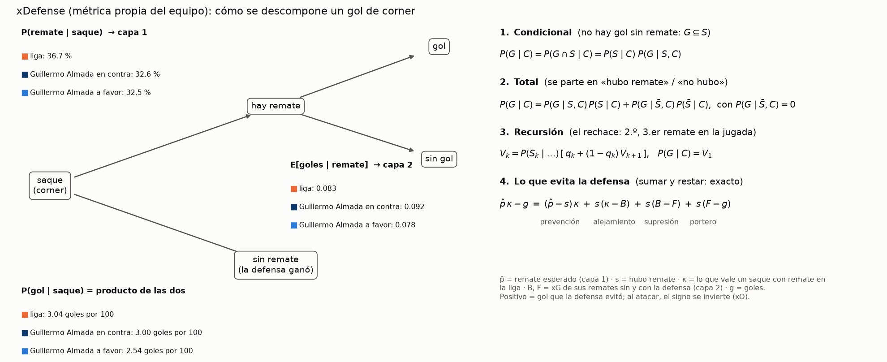

*Cómo leerlo: de izquierda a derecha, primero se cobra el corner; o hay remate o la defensa gana; y si
hay remate, o entra o no. Cada rama lleva su número para la liga (naranja), para Almada defendiendo
(azul oscuro) y para Almada atacando (azul). La probabilidad de gol es **el producto** de las ramas
que se recorren.*

#### La pequeña demostración (pura probabilidad condicional y total)

Llamemos $C$ al saque, $S$ a "hubo remate" y $G$ a "hubo gol".

1. **Probabilidad condicional.** No hay gol sin remate ($G \subseteq S$), así que
   $$P(G\mid C)=P(G\cap S\mid C)=P(S\mid C)\cdot P(G\mid S,C).$$
   El primer factor es la **capa 1** (¿te rematan?) y el segundo la **capa 2** (¿entra el remate?).
2. **Probabilidad total.** Partiendo en "hubo remate" y "no hubo":
   $$P(G\mid C)=P(G\mid S,C)\,P(S\mid C)+P(G\mid \bar S,C)\,P(\bar S\mid C),$$
   y el segundo término vale cero. Es la misma cuenta vista desde el otro lado.
3. **Recursión.** Si el primer remate no entra, el rebote puede dar un segundo remate, y así. Con
   $q_k$ = la probabilidad de que entre el $k$-ésimo remate, aplicar los pasos 1 y 2 una y otra vez da
   $$V_k=P(S_k\mid\ldots)\,\big[\,q_k+(1-q_k)\,V_{k+1}\big],\qquad P(G\mid C)=V_1 .$$
   Es decir: "o entra este remate, o no entra y empieza el mismo problema con el siguiente".
4. **Lo que evita la defensa, en cuatro pedazos exactos.** Sumando y restando lo mismo (nada se
   aproxima), los goles que una defensa evita en un saque se parten en
   $$\hat p\,\kappa-g=\underbrace{(\hat p-s)\,\kappa}_{\text{prevención}}+\underbrace{s\,(\kappa-B)}_{\text{alejamiento}}+\underbrace{s\,(B-F)}_{\text{supresión}}+\underbrace{s\,(F-g)}_{\text{portero}} ,$$
   donde $\hat p$ es la probabilidad de remate esperada (capa 1), $s$ si hubo remate, $\kappa$ lo que
   vale en la liga un saque que sí tuvo remate, $B$ y $F$ el xG de sus remates sin y con la foto de la
   defensa (capa 2) y $g$ los goles. Cada pedazo contesta una pregunta: ¿**negó** el remate?, ¿lo
   **empujó** a un lugar peor?, ¿**tapó** el arco?, ¿**atajó** el portero? Al atacar es lo mismo con
   el signo al revés (xO: goles de más).

La versión formal, con sus demostraciones, está en `04_MODELO_MATEMATICO.md` §16.5–16.6.

#### La capa 2 en un dibujo

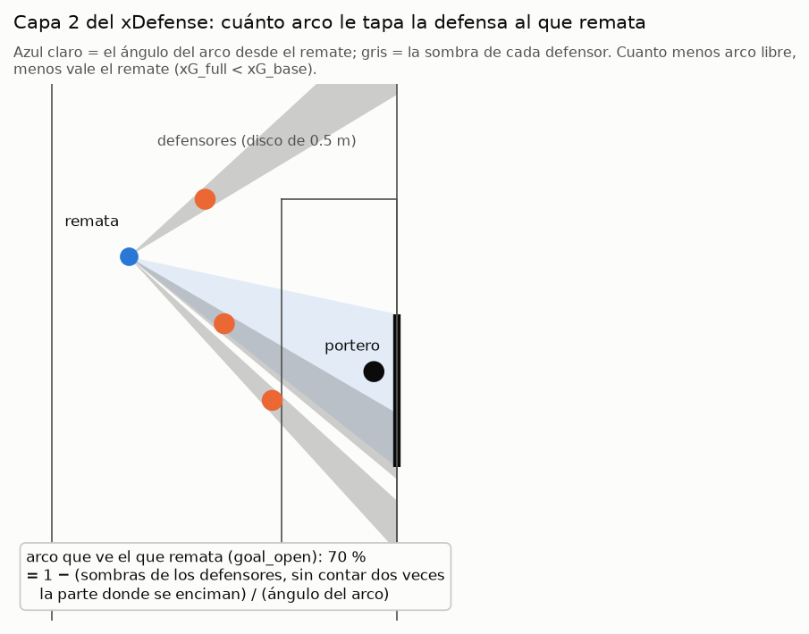

* **Los modelos:** la capa 1 (¿habrá remate?) sale de 28,216 centros, con AUC 0.63 y bien calibrada.
  La capa 2 sale de 46,641 remates. Añadir la foto de la defensa (cuánto arco queda abierto, dónde
  está el portero) sube el AUC de 0.758 a 0.785 (+0.027 [+0.022, +0.031]): **la posición de la
  defensa sí informa**.

#### Los cuatro pedazos, en las tres familias

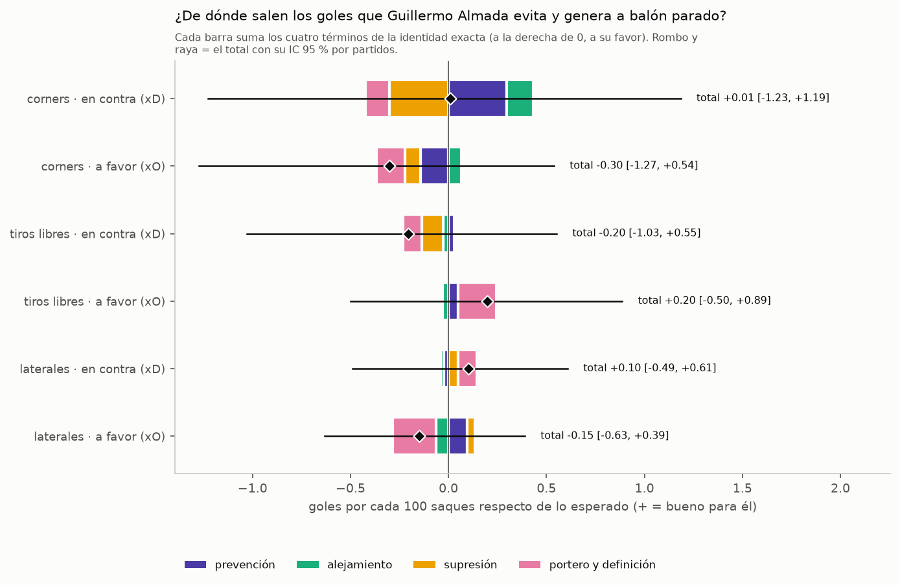

*Cada barra suma los cuatro pedazos: a la derecha del cero es bueno para Almada. Arriba de cada par,
defendiendo (xD); abajo, atacando (xO).*

⏳ **Qué dice:** en qué familia gana o pierde goles Almada y por cuál de los cuatro caminos.

---

### 5.2 Corners

#### En contra: Almada defendiendo

* Le rematan en **33 de cada 100 corners** en contra; en la liga, en 37. Contando todo lo que pasa
  en los 15 segundos después del saque, **le rematan 14 % menos** por corner (razón 0.86 [0.76,
  0.97]). *Antes decíamos 26 % menos: era con una definición más corta de la jugada, que contaba
  solo el primer remate. Con la definición nueva la ventaja se achica, pero sigue.*
* **Cómo se para** (H26 🟢): pone **menos gente en el área** (6.7 defensores contra 8.7,
  percentil 3) y casi nadie en los palos (primer palo cubierto en 8 de cada 100 corners; la liga, 15).
  **Marca al hombre** en 53 de cada 100 duelos (la liga, 39; percentil 99), **más pegado** (2.2 m
  contra 2.7, percentil 1) y deja **menos defensores sobrando** (2.2 contra 3.0). Es un plan
  claro: cada defensor con su atacante, y pocos cuidando espacios.

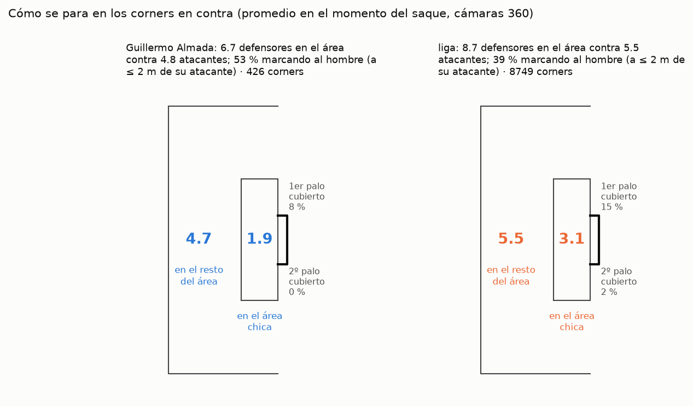

*Cuántos defienden el área chica y el resto del área, si cubre los palos y cuántos marcan al hombre.*

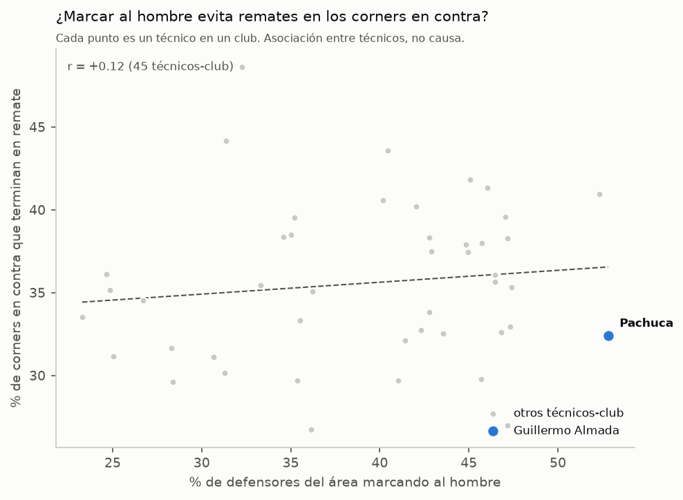

*Cada punto es un técnico en un club. Si la nube baja hacia la derecha, los que marcan más al hombre
conceden menos remates. Es una asociación entre técnicos, no una causa.*

* **Prevención** (H24 ⚪): ¿le rematan menos de lo que "debería" pasar con esos centros? Evita
  +0.014 remates por centro [−0.011, +0.040]. Es positivo pero **no se distingue de cero**. Después de
  descontar la suerte queda en el lugar **17 de 45**, a mitad de tabla.
* **Supresión** (H25): cuando le rematan, ¿su defensa hace el remate más difícil? **Al revés:** los
  remates que concede valen un poco **más** de lo que valdrían sin su defensa (−0.005 de xG por remate
  [−0.008, −0.002]). Tiene lógica con su plan: al marcar al hombre y dejar vacíos los palos,
  **concede menos remates, pero los que concede llegan más limpios**.
* **Lo importante:** en supresión, la variación real entre los 45 técnicos es **casi cero**
  (τ² ≈ 3·10⁻⁶). Ningún técnico de la liga se separa de los demás. Lo que decide un corner en
  contra es **si te rematan**, no cómo defiendes el remate. Coincide con la literatura sobre
  corners: los goles son muy pocos y el ruido es enorme.

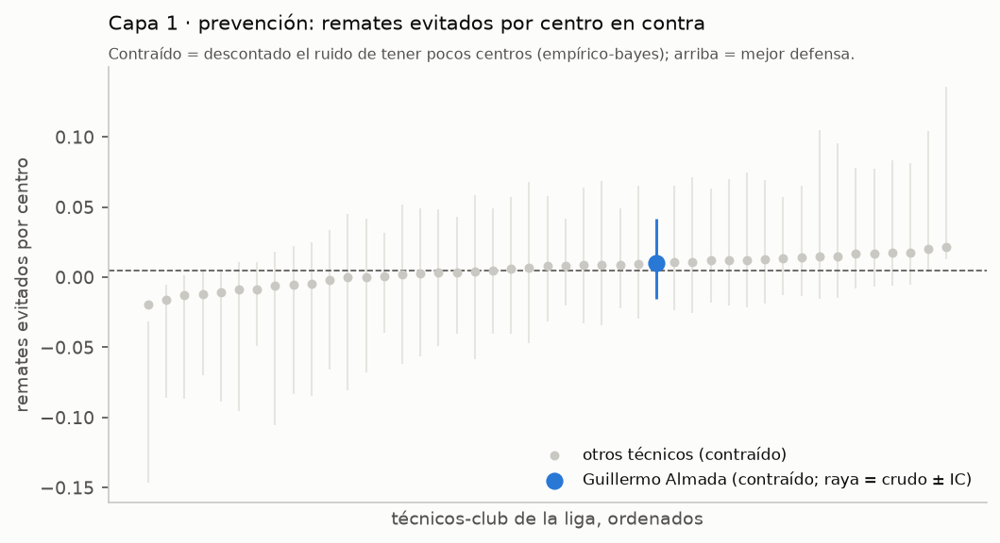

*Cómo leerla: cada fila es un técnico en un club, del mejor (arriba) al peor (abajo). El punto hueco es
su valor crudo; el lleno, lo que queda al descontar la suerte de tener pocos corners. Cuanto más corta
la raya entre los dos, más confiable es el dato. Almada va en azul y en negritas, con su puesto en el
título.*

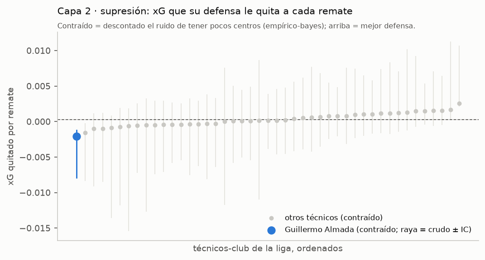

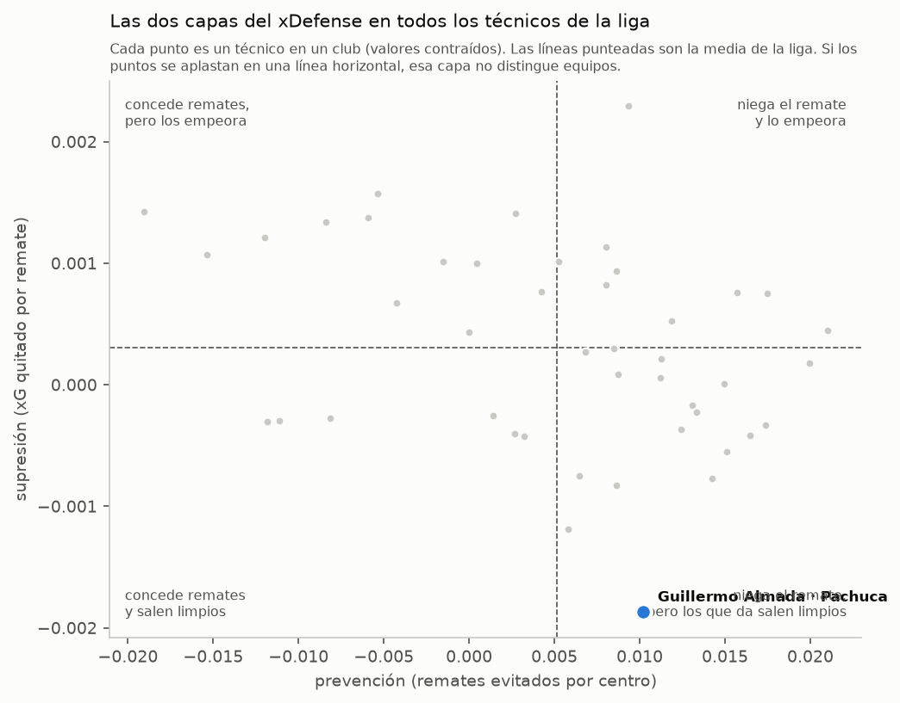

*Arriba a la derecha, los que niegan el remate y además lo empeoran. Almada está a la derecha
(niega un poco más que la media) pero abajo (los remates que da salen más limpios). Que los puntos
casi no se separen hacia arriba o hacia abajo es la forma visual de "τ² ≈ 0".*

*Nota: H24 y H25 se pre-registraron sobre **todos los centros al área** (corners, tiros libres al área
y laterales largos; los corners son la gran mayoría). Solo corners, con los cuatro pedazos:* ⏳

#### A favor: Almada atacando (y la "receta Arsenal")

* **Almada:** saca **más corners** que casi todos (6.2 por partido contra 4.9, percentil 90). Juega
  **más en corto** (35 de cada 100 contra 21) y los manda más cerrados. Pero mete menos gente al área
  (5.2 atacantes contra 5.5) y casi nadie encima del portero. Remata en 32 de cada 100 corners (la
  liga, 37) y saca 0.029 de xG por corner contra 0.035 (🟡). **Hay margen: tiene muchos corners y
  los aprovecha poco.**

El Arsenal de Nicolas Jover se volvió famoso por sus corners: **cerrados al área chica o al primer
palo, con jugadores encima del portero**. No tenemos datos de la Premier, pero sí podemos preguntar
**si esa receta funciona en la Liga MX** y si Almada la usa. Para cada tipo de corner (cómo se patea
× a dónde va) medimos cuánto xG produce en toda la liga.

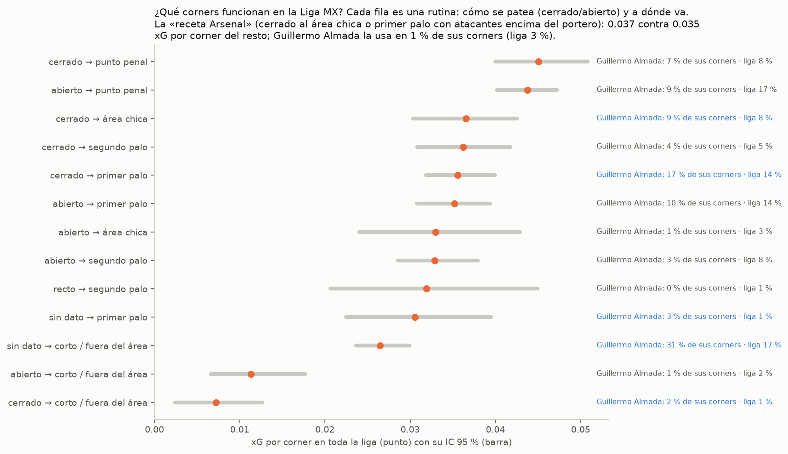

**Qué dice:**

* **En la Liga MX, el corner que más produce es el cerrado (hacia el arco) al punto penal:** 0.045 de
  xG por corner. El promedio es 0.035.
* **La "receta Arsenal" no da ventaja en la Liga MX:** cerrado al área chica o al primer palo, con
  atacantes encima del portero, produce 0.036 de xG por corner contra 0.035 del resto (+0.001
  [−0.007, +0.012]). Almada la usa en 1 de cada 100 corners; la liga, en 3.
* **Nuestra opinión:** lo del Arsenal no es "una receta", es **un método**: un especialista, rutinas
  ensayadas, bloqueos y mucho volumen. Copiar la forma (cerrado y encima del portero) no alcanza, y
  puede haber razones propias de la liga (cómo salen los porteros, cuánto contacto permite el árbitro
  en el área chica) que **no medimos**. Lo que sí se puede trasladar es **el método**: medir qué rutina produce más en esta liga y
  ensayarla. Aquí sería **cerrado al punto penal**.

⏳ **Su xO en corners:** si sus corners generan más o menos goles que lo esperado, y por qué pedazo.

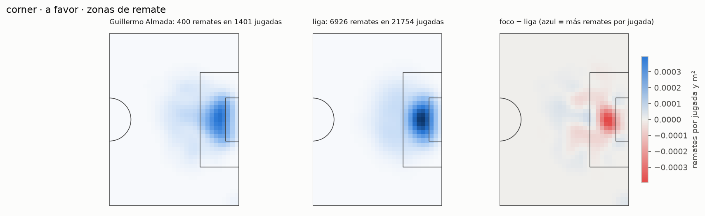

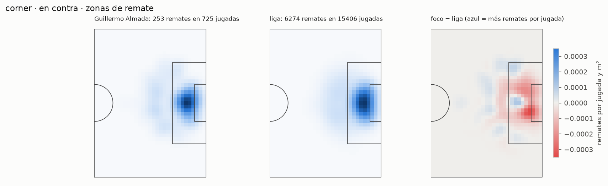

#### La liga en general

⏳ De cada 100 corners en la Liga MX, cuántos terminan en remate y cuántos en gol; cuánto vale un corner
que sí tuvo remate (κ); y cuánto se separan los técnicos entre sí en cada pedazo (τ²).

**Qué dice la evidencia.** La marca al hombre contra la zonal es un debate viejo que la literatura
ha medido en ligas europeas (Pulling, Robins & Rixon 2013; Casal et al. 2015), y los trabajos con datos
de seguimiento han estudiado las rutinas de corner por el destino y el movimiento de los atacantes
(Power et al. 2018; Shaw & Gopaladesikan 2020). Nosotros no importamos sus conclusiones: medimos lo
mismo en la Liga MX. Lo que encontramos es que un corner vale poco y es muy ruidoso, que la prevención
separa un poco a los equipos y que la supresión casi nada.

---

### 5.3 Tiros libres

Un tiro libre en campo rival se juega de tres maneras: **directo** al arco, **al área** (un centro,
como un corner) o **corto / a la banda**. Cada una tiene su defensa: contra el directo, **la barrera
y el portero**; contra el centro, **la línea del fuera de lugar**.

**Qué dicen las reglas y la evidencia.**

* La barrera debe estar a **9.15 m** del balón y, desde 2019, si la forman 3 o más defensores, los
  atacantes deben quedarse al menos a 1 m de ella (reglas del juego de la IFAB, regla 13). Por eso la
  medimos: cuántos la forman y **cuánto arco deja libre** (el mismo cálculo de la capa 2).
* En el directo, lo que más pesa en la probabilidad de gol es la **distancia y el ángulo**, y el balón
  tiene que pasar por encima o alrededor de la barrera y bajar antes del arco (Bray & Kerwin 2003).
  Por eso contamos **cuántos tiros libres concede a ≤ 30 m**: el mejor tiro libre en contra es el que
  no se comete.
* En el centro, la defensa elige **qué tan alta pone la línea**: más arriba deja espacio a la espalda
  pero deja atacantes en fuera de lugar (regla 11).

#### En contra: Almada defendiendo

En un tiro libre lateral, el que defiende elige **qué tan adelante pone su línea**: más adelante
deja más espacio atrás pero deja a los atacantes en fuera de lugar más seguido. Medimos, en la
foto del cobro, a cuántos metros de su arco está el **penúltimo defensor** (la línea legal del
fuera de lugar) y cuántos tiros libres en contra terminan en fuera de lugar (H26).

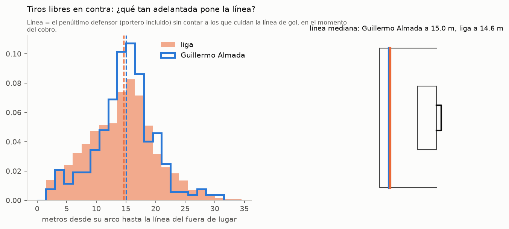

*Medimos la línea **táctica**: el último defensor de la línea sin contar al que se queda pegado al
poste. Si no, un solo jugador en el palo "baja" la línea hasta el arco.*

* Pone la línea a **14.9 m de su arco**; la liga, a 14.2. **No es distinta** (⚪).
* Pone **menos gente en la línea** (4.7 defensores contra 5.3, 🟢). Es la misma idea que en los
  corners: menos cuerpos, más marca.
* Los tiros libres que terminan en fuera de lugar **no son más** que en la liga (⚪). **Su línea
  no es especialmente adelantada**; es normal.

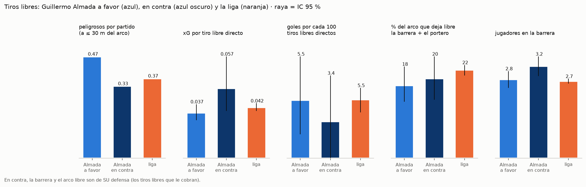

⏳ **La barrera y los tiros libres peligrosos:** cuántos concede a ≤ 30 m por partido, cuántos forman
su barrera, cuánto arco deja libre y su xD de tiros libres (los cuatro pedazos).

#### A favor: Almada atacando

⏳ Cuántos tiros libres peligrosos le cometen, cómo los juega (directo, al área o corto) y su xO.

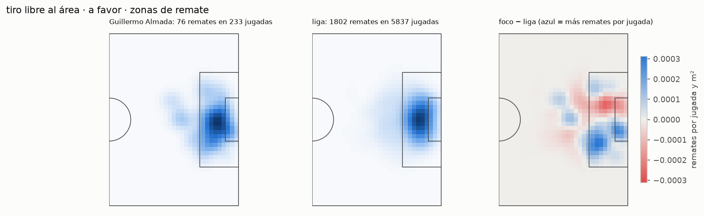

#### La liga en general

⏳ Cuántos tiros libres a ≤ 30 m hay por partido, qué parte se patea directo, cuántos goles salen de
cada 100 directos y cuánto arco deja la barrera promedio.

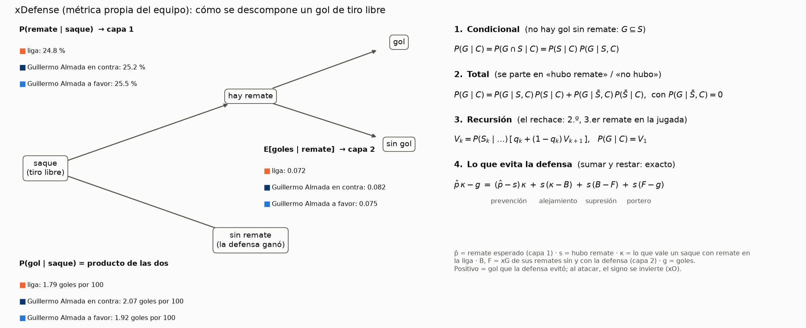

---

### 5.4 Laterales en el último cuarto de la cancha

Todo lateral sacado **desde el último cuarto** de la cancha rival (a 30 m o menos de la línea de fondo;
x ≥ 90 m) y, por separado, **desde el último octavo** (a 15 m o menos; x ≥ 105 m), caiga o no en el área.

**Por qué los laterales son distintos.** De un lateral **no se puede hacer gol directo** y **no hay
fuera de lugar** si el balón viene directo del saque (reglas 15 y 11). Así que siempre hace falta al
menos otro jugador, y los atacantes se pueden parar donde quieran. Por eso miramos la **segunda
jugada**: **cuántos jugadores intervienen** entre el saque y el remate. Con 1, el que recibe remata;
con 2, uno la peina y otro remata (el lateral largo "a lo Stoke"). El lateral es la reanudación más
frecuente del partido y una de las menos estudiadas (Stone, Smith & Barry 2021).

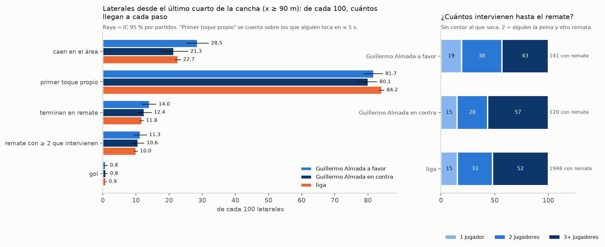

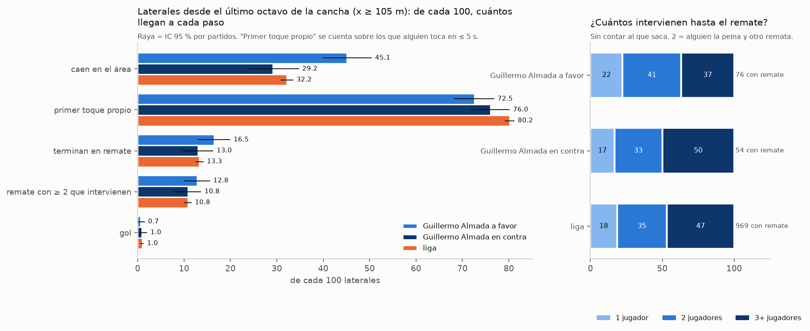

#### A favor: Almada atacando

⏳ Cuántos laterales saca por partido en el último cuarto, cuántos manda al área (y al área chica),
cuántos terminan en remate, **cuántos con dos o más que intervienen**, cuántos en gol, y su xO.

#### En contra: Almada defendiendo

⏳ Lo mismo, de los laterales que le sacan, y su xD de laterales (los cuatro pedazos).

#### La liga en general

⏳ En la Liga MX: de cada 100 laterales del último cuarto, cuántos caen en el área, cuántos terminan en
remate y cuántos en gol; y de los que caen **en el área chica y terminan en remate**, cuántos
necesitaron **dos o más** jugadores.

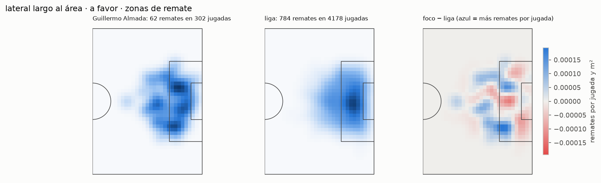

---

### Referencias del balón parado

* Bray, K. & Kerwin, D. (2003). Modelling the flight of a soccer ball in a direct free kick.
  *Journal of Sports Sciences*.
* Casal, C. A. et al. (2015). Analysis of corner kick success in elite football. *International
  Journal of Performance Analysis in Sport*.
* Efron, B. & Morris, C. (1975). Data analysis using Stein's estimator and its generalizations. *JASA*.
* IFAB. *Reglas del juego* (reglas 11, 13 y 15).
* Power, P., Hobbs, J., Ruiz, H., Wei, X. & Lucey, P. (2018). Mythbusting set-pieces in soccer.
  *MIT Sloan Sports Analytics Conference*.
* Pulling, C., Robins, M. & Rixon, T. (2013). Defending corner kicks: analysis from the English
  Premier League. *International Journal of Performance Analysis in Sport*.
* Shaw, L. & Gopaladesikan, S. (2020). Routine inspection: a playbook for corner kicks.
* Stone, J. A., Smith, A. & Barry, A. (2021). The undervalued set piece: analysis of soccer throw-ins
  during the English Premier League 2018–2019 season.

---

## 6. Simulación (y cómo le iría en el América)

### ¿Sus puntos se explican?

* **Por sus ocasiones:** con la calidad de cada remate a favor y en contra (xG), sus 166 partidos
  valían **263 puntos**; sacó **276**. Son 13 de más, pero eso **cabe en la suerte**.
* **Por su estilo:** simulando cada partido 10 mil veces con su manera de jugar y la del rival,
  esperábamos **257**.

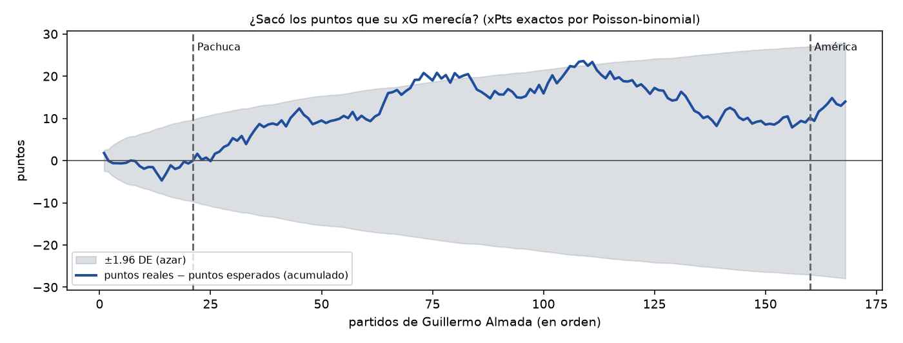

### ¿Cómo le iría en el América con los jugadores que encontró?

En el América solo lleva 7 partidos: muy pocos para juzgarlo. Así que hicimos lo que haría un
analista con una calculadora muy grande:

1. **El plantel que encontró:** cuánto atacaba y defendía el América (en xG) en sus 17 partidos
   antes de que llegara.
2. **Lo que Almada le hace a un equipo cuando llega:** lo medimos en su llegada a Pachuca (la de
   Santos no tiene 17 partidos antes y después). Luego lo "acercamos" al promedio de **las 69
   llegadas de técnicos de la liga**, porque con una sola llegada podría ser suerte y porque cualquier
   técnico nuevo suele mejorar un poco solo por llegar.
3. **Simulamos 10 mil torneos** con ese América y el resto de la liga.

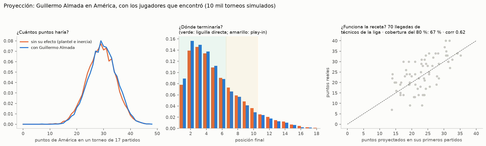

**Qué dice:**

* **El América que encontró ya era bueno:** atacaba 11 % más que un equipo promedio y concedía 22 %
  menos.
* **Lo que Almada suele hacer al llegar:** casi no mueve el ataque (+1 %; la llegada promedio de la
  liga, +5 %), pero **baja lo que concede un 10 %** (la liga, 2 %). Llega a ordenar la defensa.
* **Con él:** 1.48 xG a favor y 0.97 en contra por partido, **29.6 puntos en 17 partidos** (del 23 al
  36 en 8 de cada 10 torneos). Posición media: 5.º. **Liguilla directa en 73 de cada 100 torneos** y
  play-in en 19.
* **Sin su efecto** (el plantel solo): 29.2 puntos, posición 5.3 y liguilla directa en 70 de cada 100.
  **Almada le suma poco a un plantel que ya era bueno.**
* **Contra lo que ya pasó:** en sus primeros 7 partidos, la receta esperaba 12.8 puntos (entre 9 y 17)
  y sacó **16**. Va por arriba, dentro de lo posible.
* **¿Cuánto creerle?** Aplicamos la misma receta a las 69 llegadas de técnicos de la liga:
  * se equivoca en 0.30 puntos por partido. **Solo "el equipo seguirá igual" se equivoca en 0.31.**
    La receta casi no le gana a la inercia;
  * sus rangos "del 80 %" aciertan **solo en 67 de cada 100**: son **demasiado estrechos**. Hay que
    leerlos más anchos.

  **La proyección es razonable, pero no es una bola de cristal.**

---

## Las hipótesis, en una tabla

| pregunta | respuesta | ¿qué tan seguros? |
|---|---|---|
| ¿Ataca distinto que la liga? (H1) | Sí: más Directa, menos Circulación estéril | 🟢 confirmado |
| ¿Le cambia el partido al rival? (H2) | Sí: el rival juega más Directa | 🟢 confirmado |
| ¿Reacciona al marcador distinto? (H3) | Sí: reacciona **menos** que la liga | 🟢 confirmado |
| ¿Cambia en los últimos minutos? (H4) | No detectamos diferencia | ⚪ |
| ¿Juega distinto de local? (H5) | No detectamos diferencia | ⚪ |
| ¿Reacciona al rival fuerte distinto? (H6) | Sí: reacciona **menos** que la liga | 🟢 confirmado |
| ¿Sus ataques son más eficientes? (H7) | No: más jugadas suyas terminan en remate, pero cada una vale lo mismo. Gana por **volumen** | ⚪ |
| ¿Sus rivales son menos eficientes? (H8) | Sí, en Directa y en Ataque elaborado | 🟢 confirmado |
| ¿Su huella viaja a otro club? (H9) | Sí (Directa del rival), y todas las métricas de presión y bloque | 🟢 |
| ¿Cambia antes que la liga? (H13) | Unos 2 min antes perdiendo o empatando, pero no alcanza | ⚪ pista |
| ¿Su banca reacciona distinto al marcador? (H14) | No detectamos diferencia | ⚪ |
| ¿Qué tipo de cambios hace? (H15) | Del mismo puesto; pocos ofensivos | 🟢 confirmado |
| ¿Reacomoda la formación? (H16) | Menos que la liga (1.4 contra 1.8) | 🟢 confirmado |
| ¿Rota su once? (H17) | Casi igual que la liga | 🔎 solo exploratorio |
| ¿Ataca más vertical? (H18) | Sí: 28 cm de cada metro hacia el arco (la liga, 25), y más rápido | 🟢 confirmado |
| ¿Progresa por otros carriles? (H19) | Un poco más por dentro | 🟡 pista (q = 0.07 en el global) |
| ¿Llega al área de otra manera? (H20) | Sí: conduciendo, casi sin centros | 🟢 confirmado |
| ¿Toca la pelota con otros dibujos? (H21) | Sí: más ABCD, menos triangulación que vuelve | 🟢 confirmado |
| ¿Se ajusta al rival distinto que la liga? (H22) | No: juega igual contra todos, como se ajusta la liga | ⚪ |
| ¿Sus cambios cambian el juego? (H23) | No en xG; sí un poco en la manera de atacar (menos Directa) | ⚪ |
| ¿Niega remates a balón parado? (H24) | Positivo pero no se distingue de cero | ⚪ |
| ¿Empeora los remates que concede? (H25) | Al revés: los que concede llegan algo más limpios. Además, nadie en la liga se separa | 🟢 en contra de lo esperado |
| ¿Se organiza distinto a balón parado? (H26) | Sí: menos gente en el área, al hombre y pegado | 🟢 confirmado |
| ¿Se le reconoce? | Sí: 89 de 100, 4.º de 45 | 🟢 (p < 0.01) |
| ¿Es él y no el club? | Sí: 86 de 100 contra Pachuca sin él | 🟢 (p < 0.01) |

🟢 = los datos lo muestran con claridad, incluso corrigiendo por hacer muchas preguntas a la
vez · 🟡 = pista: pasa en su sección pero no en la corrección global · ⚪ = no encontramos diferencia (no quiere decir que no exista) · 🔎 = solo exploratorio.

## Lo que NO sabemos (y lo decimos)

* **En Santos solo dirigió 20 partidos y en el América 7.** Lo de esos clubes es exploratorio.
* **Nada de esto es causa y efecto.** Describimos lo que hizo su equipo; no podemos separar del
  todo al técnico de sus jugadores.
* **Las cámaras 360 no ven a todos.** Medimos solo con los jugadores que aparecen en cada foto
  (por eso el control de cámara del bloque).
* **El xG y el OBV son modelos del proveedor.** Por eso revisamos la eficiencia con los dos y
  con algo que no depende de ningún modelo (cuántas jugadas terminan en remate). Coinciden.
* **Una rutina de corner no "causa" goles:** el equipo que la elige no es un equipo al azar.
* **La proyección es un ejercicio para explicar**, no una apuesta.

## En una frase

> **Guillermo Almada impone la misma idea en cada club: aprieta encima, defiende angosto,
> sale largo y remata mucho; es el segundo técnico más reconocible de la Liga MX y su receta
> no cambia ni con el marcador ni con el club.**
